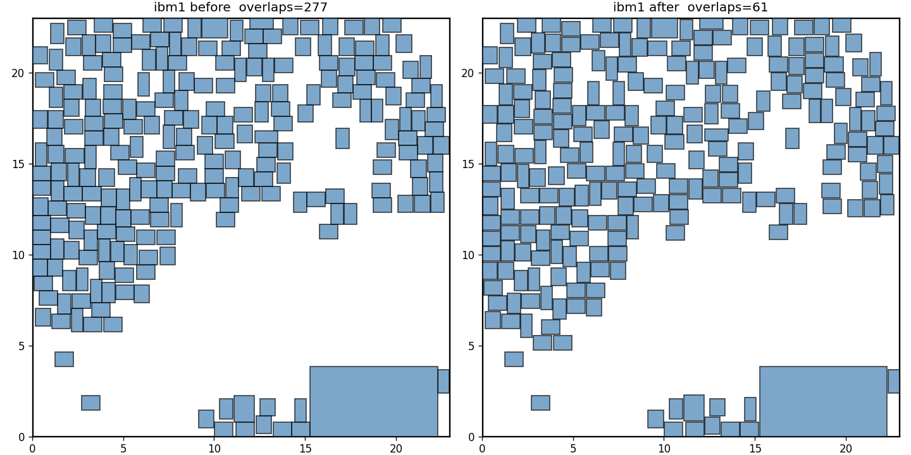
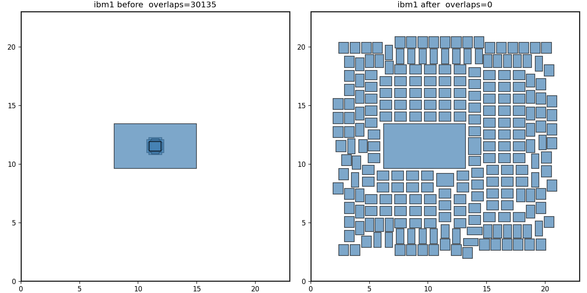

This is not a competition submission, (fork was created after closing). I'm just curious.

# Plan

Two parts to the problem:

|  | Characteristics | Cost |
|:---|:---:|---:|
| Legalization | discrete, combinatorial, local, dynamic (moving) hard constraints | displacement from illegal, residual wirelength |
| Relative placement | discrete (can be relaxed), combinatorial, global, soft constraints | wirelength, density, dataflow |

## 1. Legalization

Approach: constraint graph + lp

We map out the hard separation constraints to a pairwise graph and use existing linear programming packages to satisfy them while minimizing displacement to a target. Aims to preserve approximate position:

<b>Legalization on IBM1, overlaps=0, positions preserved</b>

<b>Legalization when all overlapping (centred)</b>

## 2. Global placer in front of legalizer

## 3. Co-optimization
